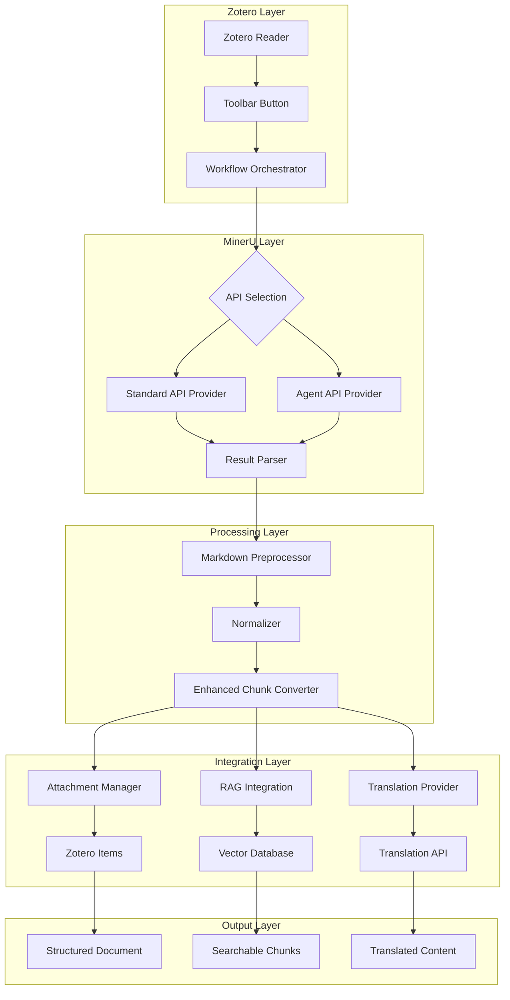

# Structured Literature Workspace

[](https://www.typescriptlang.org/)
[](https://www.zotero.org/)
[](https://mineru.net/)
[](LICENSE)

A Zotero 8/9 plugin that transforms PDF papers into structured, paragraph-level literature workspaces using MinerU as the parsing engine and Zotero as the reading surface.

**This is not a generic PDF-to-Markdown utility.** The project builds infrastructure for block-level academic reading, translation, export, and future AI-assisted understanding.

## Key Features

### Dual MinerU API Integration
- **Standard API (精准解析)**: High-precision parsing with deep structure extraction, multimodal support (tables/formulas/images), and complex layout adaptation
- **Agent API (轻量解析)**: Lightweight parsing with IP-based rate limiting, no authentication required

### Zotero Integration
- **Reader Toolbar Button**: One-click parsing directly from Zotero's PDF reader
- **Attachment Management**: Automatic addition of parsed results (Markdown, JSON, images) to Zotero items
- **Annotation Support**: Gray translation highlight cards with PDF page anchoring

### Structured Data Processing
- **Block-Level Parsing**: Text, figure, table, and formula classification
- **Enhanced Chunking**: Leverages MinerU's advanced API results for intelligent text segmentation
- **Normalization Layer**: Converts raw MinerU output into typed internal entities

### Knowledge Management
- **RAG Integration**: Automatic indexing to Retrieval-Augmented Generation services
- **Translation Support**: Contextual paragraph translation with full document awareness
- **Vault Export**: Structured export to local knowledge vaults

## Quick Start

### Prerequisites
- Node.js >= 20
- Zotero 8 or 9
- MinerU API access (Standard API requires token, Agent API is free)

### Installation

```bash
# Clone the repository
git clone https://github.com/yourusername/zotero-mineru-structured-literature-workspace.git
cd zotero-mineru-structured-literature-workspace

# Install dependencies
npm install

# Build the plugin
npm run build
```

### Basic Usage

1. **Parse a PDF from Zotero Reader**:
   - Open a PDF in Zotero's built-in reader
   - Click the "MinerU 解析" button in the toolbar
   - Wait for parsing to complete
   - View structured results in the Zotero panel

2. **Parse via Command Line** (for testing):
   ```bash
   python scripts/mineru_agent_parse.py "/path/to/paper.pdf"
   ```

3. **Run Tests**:
   ```bash
   npm test
   npm run check
   ```

## Architecture

The system follows a layered architecture with clear separation of concerns:



### Core Workflow

```text
Selected Zotero PDF
  → MinerU API Parse (Standard or Agent)
  → Raw Result Download (Markdown, JSON, Images)
  → Markdown Preprocessing
  → Block-Level Normalization
  → Enhanced Chunking (using API metadata)
  → Attachment Management (add to Zotero item)
  → RAG Integration (optional)
  → Translation (optional)
  → Zotero Annotation Creation (optional)
```

### Module Structure

```text
src/
├── mineru/                    # MinerU API integration
│   ├── client.ts              # Provider interface
│   ├── config.ts              # Configuration types
│   ├── provider-agent.ts      # Agent API implementation
│   └── provider-standard.ts   # Standard API implementation
├── zotero/                    # Zotero integration
│   ├── annotations.ts         # Annotation payload builder
│   ├── attachment-manager.ts  # File attachment management
│   ├── reader-toolbar.ts      # Reader UI integration
│   └── mineru-workflow.ts     # Core workflow orchestrator
├── normalize/                 # Data normalization
│   ├── normalizer.ts          # Raw to internal schema conversion
│   ├── chunk-converter.ts     # Standard chunking
│   └── enhanced-chunk-converter.ts  # API-enhanced chunking
├── model/                     # Internal data models
│   ├── document.ts            # Document entity
│   ├── block.ts               # Block entity
│   ├── chunk.ts               # Chunk entity
│   └── asset.ts               # Asset entity
├── parse/                     # Parsing orchestration
│   ├── parse-service.ts       # Main parse service
│   └── markdown-preprocessor.ts  # Markdown processing
├── translate/                 # Translation services
│   ├── provider.ts            # Translation interface
│   └── contextual-translator.ts  # Context-aware translation
├── rag/                       # RAG integration
│   └── rag-integration.ts     # Vector database indexing
├── export/                    # Vault export
├── ai/                        # AI extension points
├── ui/                        # UI components
└── utils/                     # Utilities
```

## API Documentation

### MinerU Standard API

High-precision parsing with rich metadata extraction.

```typescript
interface MineruStandardConfig {
  baseUrl: string;           // e.g., "https://mineru.net/api/v4"
  apiKey: string;            // Required for authentication
  modelVersion?: "pipeline" | "vlm" | "MinerU-HTML";
  isOcr?: boolean;           // Enable OCR
  enableFormula?: boolean;   // Enable formula recognition
  enableTable?: boolean;     // Enable table recognition
  language?: string;         // Document language (default: "ch")
  pageRanges?: string;       // e.g., "1-5,8"
  extraFormats?: string[];   // e.g., ["docx", "html"]
}
```

**Workflow**: POST `/extract/task` → Poll `/extract/task/{id}` → Download ZIP → Parse results

### MinerU Agent API

Lightweight parsing with IP-based rate limiting.

```typescript
interface MineruAgentConfig {
  baseUrl: string;           // e.g., "https://mineru.net/api/v1/agent"
  apiKey?: string;           // Optional for future auth
  timeoutMs?: number;        // Parse timeout (default: 300000)
  pollIntervalMs?: number;   // Poll interval (default: 3000)
}
```

**Workflow**: Create task → Upload file → Poll status → Download Markdown

### Internal Data Model

```typescript
interface Document {
  docId: string;
  zoteroItemKey: string;
  title: string;
  blocks: Block[];
  rawFiles: RawMineruFile[];
}

interface Block {
  blockId: string;
  type: "text" | "figure" | "table" | "formula";
  content: BlockContent;
  sectionPath: string[];
  pageRange: PageRange;
  order: number;
}

interface Chunk {
  chunkId: string;
  itemKey: string;
  documentId: string;
  blockId: string;
  chunkLevel: "paragraph" | "section";
  text: string;
  context: ChunkContext;
  metadata: ChunkMetadata;
  retrieval: ChunkRetrievalInfo;
}
```

## Development

### Building

```bash
# Type checking
npm run check

# Build for production
npm run build

# Run tests
npm test

# Inspect markdown blocks
npm run inspect:markdown-blocks -- "/path/to/paper.md" 8
```

### Testing

```bash
# Run all tests
npm test

# Run specific test file
npm test -- tests/parse/markdown-preprocessor.test.ts

# Run Python tests
python -m unittest tests/python/test_mineru_agent_parse.py
```

### Debugging

```bash
# Parse a PDF with Python debug script
python scripts/mineru_agent_parse.py "/absolute/path/to/paper.pdf"

# Expected output: Creates paper.md in the same directory
```

## Configuration

### Environment Variables

```bash
# MinerU Standard API
MINERU_STANDARD_API_KEY=your_api_key_here
MINERU_STANDARD_BASE_URL=https://mineru.net/api/v4

# MinerU Agent API
MINERU_AGENT_BASE_URL=https://mineru.net/api/v1/agent

# RAG Service
RAG_SERVICE_URL=http://localhost:8000
RAG_SERVICE_API_KEY=your_rag_api_key

# Translation
TRANSLATION_PROVIDER=openai
TRANSLATION_API_KEY=your_translation_key
```

### Zotero Plugin Configuration

The plugin stores configuration in Zotero's preferences system:

- **API Keys**: MinerU Standard API token
- **Vault Paths**: Local export directory
- **Workflow Options**: Auto-translate, auto-index to RAG
- **UI Preferences**: Panel layout, button placement

## Contributing

We welcome contributions! Please see our [Contributing Guide](CONTRIBUTING.md) for details.

### Development Setup

1. Fork the repository
2. Create a feature branch: `git checkout -b feature/amazing-feature`
3. Make your changes
4. Add tests for new functionality
5. Ensure all tests pass: `npm test`
6. Commit your changes: `git commit -m 'Add amazing feature'`
7. Push to the branch: `git push origin feature/amazing-feature`
8. Open a Pull Request

### Code Style

- TypeScript with strict type checking
- Clear module boundaries
- Dependency injection for testability
- Comprehensive error handling
- Unit tests for all core functionality

## Roadmap

### Completed ✅
- MinerU Standard API integration
- MinerU Agent API integration
- Zotero Reader toolbar button
- Attachment management system
- Enhanced chunk conversion
- RAG service integration
- Translation framework
- Basic vault export

### In Progress 🚧
- Live Zotero Reader text anchoring
- Real translation provider implementations
- Settings UI for API keys and preferences
- Advanced vault export with per-block files

### Planned 📋
- Zotero panel with Outline/Cards/Visuals/Export views
- Cross-paper knowledge graph
- AI-powered literature synthesis
- Obsidian bidirectional sync
- Semantic search across papers

## License

This project is licensed under the MIT License - see the [LICENSE](LICENSE) file for details.

## Acknowledgments

- [Zotero](https://www.zotero.org/) - Reference management software
- [MinerU](https://mineru.net/) - PDF parsing engine
- [TypeScript](https://www.typescriptlang.org/) - Type-safe JavaScript
- [Vitest](https://vitest.dev/) - Testing framework

## Support

- **Documentation**: [docs/](docs/)
- **Issues**: [GitHub Issues](https://github.com/yourusername/zotero-mineru-structured-literature-workspace/issues)
- **Discussions**: [GitHub Discussions](https://github.com/yourusername/zotero-mineru-structured-literature-workspace/discussions)

---

**Note**: This is an active research project. APIs and internal structures may change as we refine the system for production use.