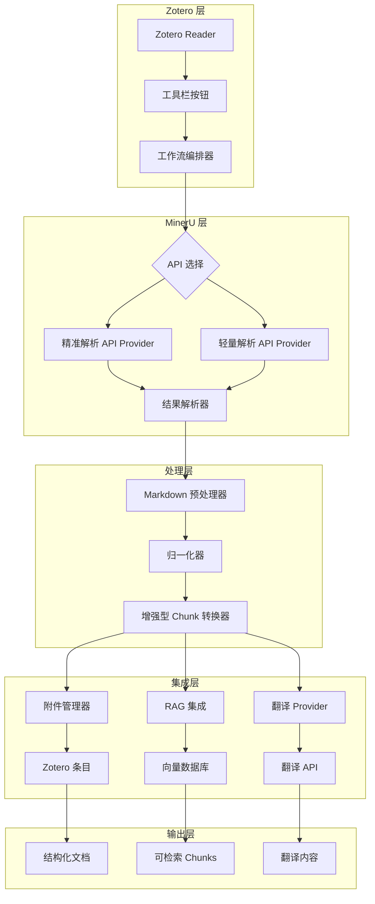

# 结构化文献工作区

[](https://www.typescriptlang.org/)
[](https://www.zotero.org/)
[](https://mineru.net/)
[](LICENSE)

一个面向 Zotero 8/9 的插件，使用 MinerU 作为解析引擎，将 PDF 论文转换为结构化、段落级的文献工作区。

**这不是一个通用的 PDF 转 Markdown 工具。** 本项目旨在构建 block-level 学术阅读、翻译、导出和未来 AI 深度理解的基础设施。

## 核心特性

### MinerU 双 API 集成
- **精准解析 API (Standard API)**：高精度解析，深度结构提取，多模态支持（表格/公式/图片），复杂版式适应
- **轻量解析 API (Agent API)**：轻量级解析，基于 IP 的频率限制，无需认证

### Zotero 集成
- **Reader 工具栏按钮**：直接从 Zotero PDF 阅读器一键解析
- **附件管理**：自动将解析结果（Markdown、JSON、图片）添加到 Zotero 条目
- **注释支持**：带 PDF 页面锚定的灰色翻译高亮卡片

### 结构化数据处理
- **Block 级解析**：文本、图片、表格、公式分类
- **增强型分块**：利用 MinerU 高级 API 结果进行智能文本分段
- **归一化层**：将 MinerU 原始输出转换为类型化的内部实体

### 知识管理
- **RAG 集成**：自动索引到检索增强生成服务
- **翻译支持**：具有全文感知的上下文段落翻译
- **Vault 导出**：结构化导出到本地知识库

## 快速开始

### 前置条件
- Node.js >= 20
- Zotero 8 或 9
- MinerU API 访问权限（精准解析 API 需要 Token，轻量解析 API 免费）

### 安装

```bash
# 克隆仓库
git clone https://github.com/yourusername/zotero-mineru-structured-literature-workspace.git
cd zotero-mineru-structured-literature-workspace

# 安装依赖
npm install

# 构建插件
npm run build
```

### 基本使用

1. **从 Zotero Reader 解析 PDF**：
   - 在 Zotero 内置阅读器中打开 PDF
   - 点击工具栏中的"MinerU 解析"按钮
   - 等待解析完成
   - 在 Zotero 面板中查看结构化结果

2. **通过命令行解析**（用于测试）：
   ```bash
   python scripts/mineru_agent_parse.py "/path/to/paper.pdf"
   ```

3. **运行测试**：
   ```bash
   npm test
   npm run check
   ```

## 架构设计

系统采用分层架构，关注点分离清晰：



### 核心工作流

```text
选中的 Zotero PDF
  → MinerU API 解析（精准解析或轻量解析）
  → 原始结果下载（Markdown、JSON、图片）
  → Markdown 预处理
  → Block 级归一化
  → 增强型分块（使用 API 元数据）
  → 附件管理（添加到 Zotero 条目）
  → RAG 集成（可选）
  → 翻译（可选）
  → Zotero 注释创建（可选）
```

### 模块结构

```text
src/
├── mineru/                    # MinerU API 集成
│   ├── client.ts              # Provider 接口
│   ├── config.ts              # 配置类型
│   ├── provider-agent.ts      # 轻量解析 API 实现
│   └── provider-standard.ts   # 精准解析 API 实现
├── zotero/                    # Zotero 集成
│   ├── annotations.ts         # 注释 payload 构建器
│   ├── attachment-manager.ts  # 文件附件管理
│   ├── reader-toolbar.ts      # Reader UI 集成
│   └── mineru-workflow.ts     # 核心工作流编排器
├── normalize/                 # 数据归一化
│   ├── normalizer.ts          # 原始到内部 schema 转换
│   ├── chunk-converter.ts     # 标准分块
│   └── enhanced-chunk-converter.ts  # API 增强型分块
├── model/                     # 内部数据模型
│   ├── document.ts            # Document 实体
│   ├── block.ts               # Block 实体
│   ├── chunk.ts               # Chunk 实体
│   └── asset.ts               # Asset 实体
├── parse/                     # 解析编排
│   ├── parse-service.ts       # 主解析服务
│   └── markdown-preprocessor.ts  # Markdown 处理
├── translate/                 # 翻译服务
│   ├── provider.ts            # 翻译接口
│   └── contextual-translator.ts  # 上下文感知翻译
├── rag/                       # RAG 集成
│   └── rag-integration.ts     # 向量数据库索引
├── export/                    # Vault 导出
├── ai/                        # AI 扩展点
├── ui/                        # UI 组件
└── utils/                     # 工具函数
```

## API 文档

### MinerU 精准解析 API

高精度解析，丰富的元数据提取。

```typescript
interface MineruStandardConfig {
  baseUrl: string;           // 例如 "https://mineru.net/api/v4"
  apiKey: string;            // 认证必需
  modelVersion?: "pipeline" | "vlm" | "MinerU-HTML";
  isOcr?: boolean;           // 启用 OCR
  enableFormula?: boolean;   // 启用公式识别
  enableTable?: boolean;     // 启用表格识别
  language?: string;         // 文档语言（默认："ch"）
  pageRanges?: string;       // 例如 "1-5,8"
  extraFormats?: string[];   // 例如 ["docx", "html"]
}
```

**工作流**：POST `/extract/task` → 轮询 `/extract/task/{id}` → 下载 ZIP → 解析结果

### MinerU 轻量解析 API

轻量级解析，基于 IP 的频率限制。

```typescript
interface MineruAgentConfig {
  baseUrl: string;           // 例如 "https://mineru.net/api/v1/agent"
  apiKey?: string;           // 可选，用于未来认证
  timeoutMs?: number;        // 解析超时（默认：300000）
  pollIntervalMs?: number;   // 轮询间隔（默认：3000）
}
```

**工作流**：创建任务 → 上传文件 → 轮询状态 → 下载 Markdown

### 内部数据模型

```typescript
interface Document {
  docId: string;
  zoteroItemKey: string;
  title: string;
  blocks: Block[];
  rawFiles: RawMineruFile[];
}

interface Block {
  blockId: string;
  type: "text" | "figure" | "table" | "formula";
  content: BlockContent;
  sectionPath: string[];
  pageRange: PageRange;
  order: number;
}

interface Chunk {
  chunkId: string;
  itemKey: string;
  documentId: string;
  blockId: string;
  chunkLevel: "paragraph" | "section";
  text: string;
  context: ChunkContext;
  metadata: ChunkMetadata;
  retrieval: ChunkRetrievalInfo;
}
```

## 开发指南

### 构建

```bash
# 类型检查
npm run check

# 生产构建
npm run build

# 运行测试
npm test

# 检查 markdown blocks
npm run inspect:markdown-blocks -- "/path/to/paper.md" 8
```

### 测试

```bash
# 运行所有测试
npm test

# 运行特定测试文件
npm test -- tests/parse/markdown-preprocessor.test.ts

# 运行 Python 测试
python -m unittest tests/python/test_mineru_agent_parse.py
```

### 调试

```bash
# 使用 Python 调试脚本解析 PDF
python scripts/mineru_agent_parse.py "/absolute/path/to/paper.pdf"

# 预期输出：在同一目录下创建 paper.md
```

## 配置说明

### 环境变量

```bash
# MinerU 精准解析 API
MINERU_STANDARD_API_KEY=your_api_key_here
MINERU_STANDARD_BASE_URL=https://mineru.net/api/v4

# MinerU 轻量解析 API
MINERU_AGENT_BASE_URL=https://mineru.net/api/v1/agent

# RAG 服务
RAG_SERVICE_URL=http://localhost:8000
RAG_SERVICE_API_KEY=your_rag_api_key

# 翻译
TRANSLATION_PROVIDER=openai
TRANSLATION_API_KEY=your_translation_key
```

### Zotero 插件配置

插件将配置存储在 Zotero 的偏好设置系统中：

- **API 密钥**：MinerU 精准解析 API Token
- **Vault 路径**：本地导出目录
- **工作流选项**：自动翻译、自动索引到 RAG
- **UI 偏好**：面板布局、按钮位置

## 参与贡献

我们欢迎贡献！请查看我们的 [贡献指南](CONTRIBUTING.md) 了解详情。

### 开发环境设置

1. Fork 仓库
2. 创建功能分支：`git checkout -b feature/amazing-feature`
3. 进行修改
4. 为新功能添加测试
5. 确保所有测试通过：`npm test`
6. 提交更改：`git commit -m 'Add amazing feature'`
7. 推送到分支：`git push origin feature/amazing-feature`
8. 打开 Pull Request

### 代码风格

- TypeScript 严格类型检查
- 清晰的模块边界
- 依赖注入便于测试
- 全面的错误处理
- 所有核心功能的单元测试

## 路线图

### 已完成 ✅
- MinerU 精准解析 API 集成
- MinerU 轻量解析 API 集成
- Zotero Reader 工具栏按钮
- 附件管理系统
- 增强型分块转换
- RAG 服务集成
- 翻译框架
- 基础 Vault 导出

### 进行中 🚧
- 实时 Zotero Reader 文本锚定
- 真实翻译 Provider 实现
- API 密钥和偏好设置 UI
- 高级 Vault 导出（支持 per-block 文件）

### 计划中 📋
- Zotero 面板（大纲/卡片/可视化/导出视图）
- 跨论文知识图谱
- AI 驱动的文献综合
- Obsidian 双向同步
- 跨论文语义搜索

## 许可证

本项目采用 MIT 许可证 - 详情请查看 [LICENSE](LICENSE) 文件。

## 致谢

- [Zotero](https://www.zotero.org/) - 参考文献管理软件
- [MinerU](https://mineru.net/) - PDF 解析引擎
- [TypeScript](https://www.typescriptlang.org/) - 类型安全的 JavaScript
- [Vitest](https://vitest.dev/) - 测试框架

## 支持

- **文档**：[docs/](docs/)
- **问题**：[GitHub Issues](https://github.com/yourusername/zotero-mineru-structured-literature-workspace/issues)
- **讨论**：[GitHub Discussions](https://github.com/yourusername/zotero-mineru-structured-literature-workspace/discussions)

---

**注意**：这是一个活跃的研究项目。随着我们为生产使用优化系统，API 和内部结构可能会发生变化。